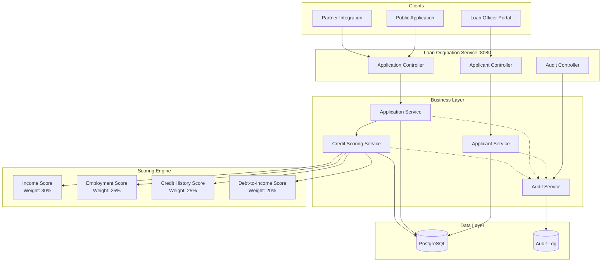

# Loan Origination Credit API

[](https://openjdk.org/)
[](https://spring.io/projects/spring-boot)
[](https://www.postgresql.org/)
[](Dockerfile)
[](LICENSE)
[](https://github.com/jzavalaq/loan-origination-credit-api/actions/workflows/ci.yml)

> A fintech loan origination system with FICO-style credit scoring, automated decision workflows, and comprehensive audit logging.

**Live Demo:** _Coming soon_ | **Swagger UI:** _Coming soon_ | **Postman Collection:** [loan-origination.postman_collection.json](postman/loan-origination.postman_collection.json)

---

## Key Features

- **FICO-Style Credit Scoring**: Weighted scoring algorithm (300-850 range) based on income, employment, credit history, and debt
- **Automated Decision Engine**: Instant approval, manual review, or decline based on configurable thresholds
- **Application Workflow**: Complete status tracking from PENDING → APPROVED/REJECTED
- **Risk Assessment**: Multi-factor risk level determination (LOW/MEDIUM/HIGH)
- **Audit Trail**: Immutable compliance-ready audit logging for regulatory requirements
- **Role-Based Access**: Loan officer, underwriter, and admin roles

---

## Architecture



---

## Credit Scoring Algorithm

The scoring engine calculates a FICO-style credit score (300-850) using weighted factors:

| Factor | Weight | Score Range | Criteria |
|--------|--------|-------------|----------|
| **Income** | 30% | 25-100 | Based on annual income brackets |
| **Employment** | 25% | 20-100 | Years at current employer |
| **Credit History** | 25% | 25-100 | Length of credit history |
| **Debt-to-Income** | 20% | 20-100 | Total debt vs. annual income |

### Decision Thresholds

| Credit Score | Decision | Risk Level |
|--------------|----------|------------|
| 700-850 | **APPROVED** | LOW |
| 600-699 | **MANUAL_REVIEW** | MEDIUM |
| 300-599 | **DECLINED** | HIGH |

---

## Architectural Decisions

| Decision | Rationale |
|----------|-----------|
| **Weighted Scoring** | Flexible algorithm allowing easy adjustment of factor weights |
| **Separate Assessment Entity** | Credit assessment stored independently for audit trail |
| **Immutable Audit Log** | Compliance with financial regulations (SOX, fair lending) |
| **DTO Pattern** | Clean API contract separation from domain entities |
| **Service Layer Isolation** | Business logic independent of controllers |

---

## Tech Stack

| Technology | Version | Purpose |
|------------|---------|---------|
| Java | 21 | Runtime environment |
| Spring Boot | 3.2.5 | Application framework |
| Spring Security | 6.x | Authentication & authorization |
| Spring Data JPA | 3.x | Data persistence |
| PostgreSQL | 15+ | Production database |
| H2 | 2.x | Development database |
| Flyway | 9.22.x | Database migrations |
| Lombok | Latest | Boilerplate reduction |
| SpringDoc OpenAPI | 2.5.0 | API documentation |

---

## Quick Start

### Option 1: Docker Compose (Recommended)

```bash
# Clone the repository
git clone https://github.com/jzavalaq/loan-origination-credit-api.git
cd loan-origination-credit-api

# Copy environment file
cp .env.example .env

# Start all services
docker-compose up -d

# View logs
docker-compose logs -f app
```

Services available:
- **API:** http://localhost:8080
- **Swagger UI:** http://localhost:8080/swagger-ui.html
- **Health Check:** http://localhost:8080/actuator/health

### Option 2: Local Development (H2)

```bash
# Build and run with H2
mvn spring-boot:run -Dspring-boot.run.profiles=dev

# H2 Console: http://localhost:8080/h2-console
# JDBC URL: jdbc:h2:mem:loanorigination
```

---

## API Examples

### Applicant Management

```bash
TOKEN="your-jwt-token"

# Create applicant
curl -X POST http://localhost:8080/api/v1/applicants \
  -H "Authorization: Bearer $TOKEN" \
  -H "Content-Type: application/json" \
  -d '{
    "firstName": "John",
    "lastName": "Doe",
    "email": "john.doe@email.com",
    "phone": "+1234567890",
    "ssn": "123-45-6789",
    "dateOfBirth": "1985-06-15",
    "annualIncome": 75000.00,
    "employmentStatus": "EMPLOYED",
    "employer": "Tech Corp",
    "employmentYears": 5,
    "creditHistoryYears": 10,
    "totalDebt": 15000.00
  }'
```

### Loan Application

```bash
# Submit loan application
curl -X POST http://localhost:8080/api/v1/applications \
  -H "Authorization: Bearer $TOKEN" \
  -H "Content-Type: application/json" \
  -d '{
    "applicantId": 1,
    "loanType": "PERSONAL",
    "requestedAmount": 25000.00,
    "requestedTermMonths": 36,
    "purpose": "Home improvement"
  }'

# Trigger credit assessment
curl -X POST http://localhost:8080/api/v1/applications/1/assess \
  -H "Authorization: Bearer $TOKEN"

# Get assessment result
curl -X GET http://localhost:8080/api/v1/applications/1/assessment \
  -H "Authorization: Bearer $TOKEN"
```

**Sample Assessment Response:**
```json
{
  "creditScore": 720,
  "riskLevel": "LOW",
  "debtToIncomeRatio": 0.20,
  "incomeScore": 70,
  "employmentScore": 80,
  "creditHistoryScore": 70,
  "debtScore": 85,
  "scoreFactors": ["No significant risk factors identified"]
}
```

### Application Decision

```bash
# Approve application
curl -X POST http://localhost:8080/api/v1/applications/1/approve \
  -H "Authorization: Bearer $TOKEN" \
  -H "Content-Type: application/json" \
  -d '{
    "approvedAmount": 25000.00,
    "approvedRate": 6.5,
    "approvedTermMonths": 36
  }'

# Reject application
curl -X POST http://localhost:8080/api/v1/applications/1/reject \
  -H "Authorization: Bearer $TOKEN" \
  -H "Content-Type: application/json" \
  -d '{
    "reason": "Insufficient credit history",
    "notes": "Recommend reapply after 6 months"
  }'
```

---

## Configuration

### Environment Variables

| Variable | Description | Default |
|----------|-------------|---------|
| `DB_URL` | PostgreSQL connection URL | `jdbc:postgresql://localhost:5432/loanorigination` |
| `DB_USERNAME` | Database username | `loan_user` |
| `DB_PASSWORD` | Database password | _Required_ |
| `JWT_SECRET` | JWT signing key (256+ bits) | _Required_ |

---

## Project Structure

```
src/main/java/com/jzavalaq/loanorigination/
├── config/          # Security, request logging
├── controller/      # REST API endpoints
├── service/         # Business logic (Applicant, Application, CreditScoring)
├── repository/      # Data access layer
├── entity/          # JPA entities (Applicant, LoanApplication, CreditAssessment)
├── dto/             # Request/Response DTOs
├── exception/       # Custom exceptions
└── util/            # Constants, utilities
```

---

## Testing

```bash
# Run all tests
mvn test

# Run with coverage
mvn test jacoco:report
```

---

## License

This project is licensed under the MIT License - see the [LICENSE](LICENSE) file for details.

---

## Author

**Juan Zavala** - [GitHub](https://github.com/jzavalaq) - [LinkedIn](https://linkedin.com/in/juanzavalaq)
